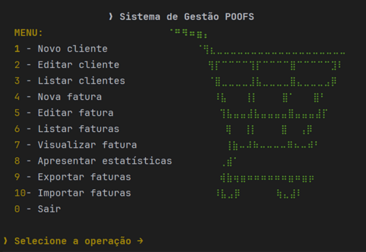

# POOFS - Financial Management System

**Course:** Object-Oriented Programming 2024/2025  
**Institution:** Department of Informatics Engineering (DEI) - University of Coimbra

## About the Project
The goal of this project was to develop a simple command line application for the financial management of a company in Java. The application operates through an interactive menu and centers its business logic on manipulating three main lists: clients, products, and invoices. The interface uses a Formatacao class with ANSI codes to apply styles and colors to the terminal, improving the graphical presentation and the reading of information.

## Main Features
The system provides a menu with the following operations:
* **Client Management:** Register new clients with unique tax IDs, edit their information (name, tax ID, or location), and list all clients in the system.
* **Invoice Management:** Create new invoices associated with existing clients and add previously registered products. Users can also edit, list, or view invoices formatted with VAT calculations.
* **Statistics:** Present general statistics, including the total number of invoices, products, gross totals, net totals, and VAT values.
* **Import and Export:** Export invoices to a text file or import them back to replace the main list.

## Product Structure and VAT Calculation
The system supports different product categories, applying specific VAT rules through an abstract calcularIva method implemented in the product subclasses.

## Data Persistence
The program ensures no information is lost between sessions:
* **Initialization:** Upon startup, the system attempts to load data from output.obj. If unavailable, it processes input.txt line-by-line using specific prefixes (CL for clients, F for invoices).
* **Shutdown:** Saves all lists as objects to output.obj using serialization (Serializable) upon exiting the program.
